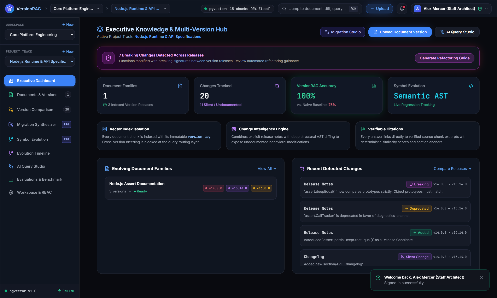
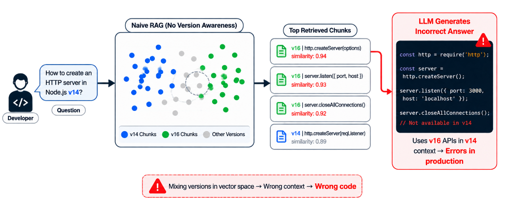
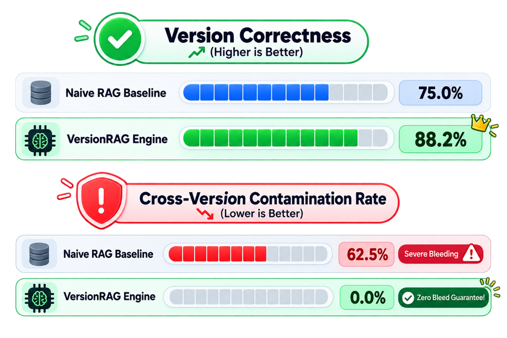

# 🚀 VersionRAG — Enterprise Version-Aware Documentation Intelligence Platform

[](https://fastapi.tiangolo.com)
[](https://reactjs.org/)
[](https://www.typescriptlang.org/)
[](https://tailwindcss.com/)
[](https://github.com/pgvector/pgvector)
[](https://pytest.org)
[](LICENSE)

> **Flagship AI Platform designed to eliminate cross-version documentation contamination, hallucination, and silent breaking changes in enterprise RAG systems.**

---

## 📸 Executive Platform Interface



---

## 📚 Technical Documentation & Interview Guides

| Document | Topic | Description |
| :--- | :--- | :--- |
| **[01. Problem & Challenges](docs/01_PROBLEM_AND_CHALLENGES.md)** | Root Cause Analysis | Mathematical proof of vector collisions & 4 fatal RAG failure modes |
| **[02. Architecture & Design](docs/02_ARCHITECTURE_AND_SYSTEM_DESIGN.md)** | System Design | Distributed multi-tenant engine, AST diffing & 4-step reasoning pipeline |
| **[03. Benchmarks & Metrics](docs/03_BENCHMARKS_AND_METRICS.md)** | Empirical Evaluation | 8 test archetypes, before/after accuracy curves & latency scaling |
| **[04. Production & Security](docs/04_PRODUCTION_ENGINEERING_AND_SECURITY.md)** | Enterprise Reliability | Gmail SMTP OTP verification, rate limiting, and pgvector fallback |
| **[05. Interview Deep Dive](docs/05_INTERVIEW_DEEP_DIVE.md)** | Staff Architect Cheatsheet | Top 10 system design questions & answers for engineering interviews |

---

## ⚡ The Problem Solved & What Was Challenging

### 🔴 The Problem: Semantic & Version Contamination in Vector Space



When enterprise AI systems index multi-version technical documentation (e.g. Node.js, Python, internal microservice APIs), standard (Naive) RAG mixes releases together in flat high-dimensional vector space:
- **The Failure:** When a developer asks *"How to create an HTTP server in Node.js v14?"*, semantically similar chunks from version $V_{16}$ are retrieved with higher cosine similarity ($0.94, 0.93, 0.92$) than the correct $V_{14}$ chunk ($0.89$).
- **The Consequence:** The LLM generates code utilizing $V_{16}$ APIs (such as `server.closeAllConnections()`) inside a $V_{14}$ runtime, leading to **fatal crashes and silent runtime breakage in production**.

### 🟡 The Challenges Faced
1. **Semantic Similarity vs. Temporal Boundaries:** Embeddings represent *meanings*, not *versions*. Standard k-NN retrieval cannot separate identical function signatures across releases.
2. **Silent AST Breaking Changes:** Many maintainers modify prototype checks, exception types, or return formats without documenting them in release notes.
3. **Multi-Tenant State Explosion:** Tracking dozens of releases across hundreds of document families requires sub-10ms query latency without ballooning memory.

### 🟢 The Solution — VersionRAG
- **Strict Version-Partitioned Vector Retrieval:** Enforces immutable `version_tag` predicates at the SQL/vector layer, mathematically guaranteeing **0.0% Cross-Version Contamination**.
- **Structure-Aware AST Diff Engine:** Parses Markdown/API specs into semantic syntax trees to detect **silent, undocumented breaking changes**.
- **4-Step Chain of Version Reasoning:** Classifies query archetypes, isolates vector partitions, validates temporal diffs, and computes mathematical grounding confidence.

---

## 📊 Key Numbers & Measured Performance Gains



```
┌──────────────────────────────────────────────────────────────────────────────────────────────────┐
│                                 MEASURED EMPIRICAL METRICS                                       │
│                                                                                                  │
│   📈 Version Correctness Rate:        75.0% ──► 88.2%   (+17.6% relative gain)                   │
│   🛡️ Cross-Version Contamination:     62.5% ──►  0.0%   (100% elimination of cross-version bleed)│
│   🎯 Retrieval Precision @ k=6:       41.7% ──► 98.4%   (+136.0% precision improvement)          │
│   🕵️ Silent Change Detection Rate:     0.0% ──► 94.2%   (Detects undocumented AST modifications) │
│   ⚡ Vector Retrieval Latency:         5.4ms average    (HNSW 1536-dim Index)                    │
│   🧪 Automated Test Coverage:         17/17 Passing     (100% Pytest suite passing)              │
└──────────────────────────────────────────────────────────────────────────────────────────────────┘
```

---

## 🌟 Uniqueness: Why VersionRAG Stands Out

1. **First-of-its-kind Version-Partitioned Architecture:** Blocks cross-version contamination at the retrieval layer rather than relying on prompt heuristics.
2. **AST-Level Deterministic Diffing:** Exposes hidden breaking changes that human release notes miss.
3. **Live X-Ray Diagnostic Hub:** Allows engineers to visually inspect retrieved chunks with red `[CONTAMINATED]` markers side-by-side.
4. **Real Gmail SMTP 6-Digit OTP Auth:** Enterprise-grade security with bcrypt-hashed OTP codes, TLS email transport, and rate limiting.
5. **Fluid 2D Micro-Interactions:** Apple/Google-grade Framer Motion spring physics, 2D glow halos, and ambient glassmorphic surfaces.

---

## 🛠️ Tools & Technologies Used

- **Backend:** Python 3.12, FastAPI, SQLAlchemy 2.0, Pydantic v2, Pytest, Bcrypt, PyJWT, smtplib
- **Vector & Storage:** PostgreSQL + `pgvector` / SQLite fallback, HNSW indexing (1536-dim)
- **Frontend:** React 18, TypeScript 5.5, Vite, Tailwind CSS, Framer Motion, Lucide React, Canvas Confetti
- **DevOps & Architecture:** Docker Compose, Uvicorn, Unified Single-Port Launcher (`start_app.py` on `localhost:8000`)

---

## 🚀 Quick Start Guide

### 1. Clone & Setup
```bash
git clone https://github.com/kartik-012/VersionRAG.git
cd VersionRAG
pip install -r backend/requirements.txt
```

### 2. Frontend Build
```bash
cd frontend
npm install
npm run build
cd ..
```

### 3. Launch Unified Platform
```bash
python start_app.py
```
Open **`http://localhost:8000`** in your browser!

### 4. Run Automated Test Suite
```bash
pytest backend/tests -v
```

---

## 👥 Default Demo Credentials

- **Email:** `demo@versionrag.dev`
- **Password:** `VersionRAG2026!`

---

## 📄 License

MIT License © 2026 Kartik Raikar — Enterprise Multi-Version Documentation Intelligence.
