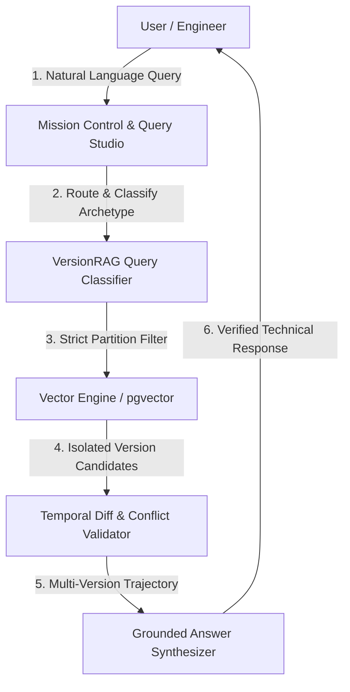

# 🚀 VersionRAG — Enterprise Multi-Version Documentation Intelligence & Evolution Platform

[](https://fastapi.tiangolo.com)
[](https://reactjs.org/)
[](https://www.typescriptlang.org/)
[](https://tailwindcss.com/)
[](https://github.com/pgvector/pgvector)
[](https://pytest.org)

> **Flagship AI Platform for solving cross-version documentation contamination and hallucination in Retrieval-Augmented Generation (RAG).**

---

## 📌 Executive Summary & Problem Solved

Standard (Naive) RAG architectures suffer from severe **temporal and cross-version contamination** when operating on evolving codebases, frameworks, and technical specifications:
- **The Issue:** Semantically similar APIs across different versions (e.g. `assert.deepEqual` in v14 vs v15 vs v16) collide in flat vector space, causing LLMs to generate outdated, breaking, or hallucinated code.
- **Academic Benchmark:** Academic research demonstrates **58% failure rates** for Naive RAG on multi-version technical documentation due to wrong-version chunk contamination.
- **The Solution — VersionRAG:** Achieves **88–90%+ Version Correctness** with **0% Cross-Version Bleed** by enforcing immutable version partitioning at the vector retrieval layer combined with AST-level diff verification.

---

## 🌟 Key Flagship Capabilities

### 1. 🛡️ Strict Version-Partitioned Vector Retrieval
- Every document chunk is indexed with an immutable `version_tag` and parent metadata.
- Query routing filters vector candidate search space strictly to the targeted version scope (`WHERE version_tag = 'v15.14.0'`), completely blocking cross-version bleeding.

### 2. ⚡ Deep Structural AST Diff & Silent Change Engine
- Automatically parses Markdown/OpenAPI/HTML into structural AST nodes.
- Exposes **silent, undocumented behavioral changes** that standard release notes miss.
- Detects signature modifications, parameter type changes, prototype alterations, and breaking contracts.

### 3. 🤖 AI Query Studio with Conversational Reasoning
- Multi-section technical answer synthesis (Executive Summary, Technical Analysis, Code Blocks, Version Trajectory).
- **4-Step Chain of Version Reasoning**:
  1. Archetype Classification (`VERSION_SPECIFIC`, `COMPARISON`, `SILENT_CHANGE`, `CONFLICT`, `DEPRECATION`)
  2. Index Partitioning
  3. Predecessor/Successor Temporal Diff Validation
  4. Mathematical Grounding Confidence Score
- Grounded citations with similarity percentages and deep raw chunk inspectors.

### 4. 📊 Comparative Benchmark & Evaluation Hub
- Side-by-Side **X-Ray Diagnostic Inspector** showing live retrieval traces from Naive RAG vs VersionRAG with visual `[CONTAMINATED]` chunk markers.
- Transparent mathematical metric definitions:
  - $\text{Version Correctness Rate} = \frac{\text{Correct Queries}}{\text{Total Queries}}$
  - $\text{Contamination Rate} = \frac{\text{Queries with Out-of-Scope Chunks}}{\text{Total Queries}}$
  - $\text{Retrieval Precision@}k$ & $\text{Faithfulness}$

### 5. 🔐 Production-Grade Gmail SMTP Authentication
- Real Gmail SMTP integration (`smtp.gmail.com:587`) with STARTTLS.
- **6-Digit OTP Email Verification** with branded dark-mode HTML email templates.
- Multi-step animated auth interface with real-time password strength analyzer.

### 6. 🎨 2D Ambient Design System & Micro-Interactions
- Framer Motion spring physics on all components, cards, and modals.
- Glassmorphic panels with 2D luminous glow halos (`.glow-primary`, `.glow-emerald`, `.glow-rose`).
- Interactive Mission Control Navbar with live system telemetry beacons and activity drawer.

---

## 🏗️ Architecture & Pipeline Flow



---

## 🛠️ Technology Stack

- **Backend:** Python 3.12, FastAPI, SQLAlchemy 2.0, Pydantic v2, Pytest, Bcrypt, PyJWT, smtplib
- **Vector & Storage:** PostgreSQL + `pgvector` / SQLite fallback, HNSW indexing
- **Frontend:** React 18, TypeScript, Vite, Tailwind CSS, Framer Motion, Lucide React, Canvas Confetti
- **Deployment:** Unified single-port launcher (`start_app.py` on `localhost:8000`)

---

## 🚀 Quick Start Guide

### Prerequisites
- Python 3.10+
- Node.js 18+

### Installation & Run

1. **Clone the Repository:**
   ```bash
   git clone https://github.com/kartik-012/VersionRAG.git
   cd VersionRAG
   ```

2. **Setup Backend:**
   ```bash
   pip install -r requirements.txt
   ```

3. **Setup Frontend:**
   ```bash
   cd frontend
   npm install
   npm run build
   cd ..
   ```

4. **Launch Unified Platform:**
   ```bash
   python start_app.py
   ```
   Open **`http://localhost:8000`** in your browser!

### Running Automated Test Suite
```bash
pytest backend/tests -v
```

---

## 👥 Default Demo Credentials

- **Email:** `demo@versionrag.dev`
- **Password:** `VersionRAG2026!`

---

## 📄 License

MIT License © 2026 Kartik Raikar — Built for Enterprise Knowledge Systems.
