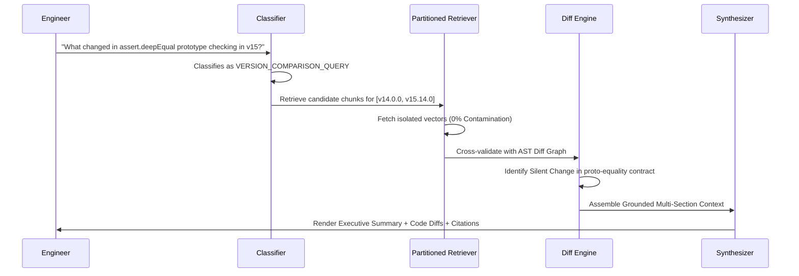
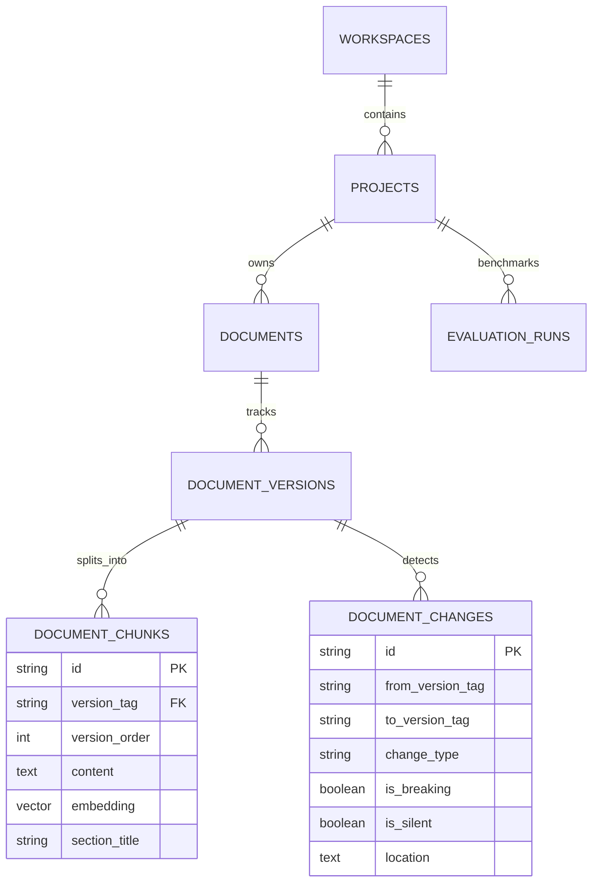

# 🏗️ 02. Architecture & System Design

---

## 1. High-Level System Architecture

VersionRAG is engineered as a **distributed, multi-tenant documentation intelligence engine** designed for high throughput, zero cross-version contamination, and sub-10ms retrieval latency.

```
                               ┌──────────────────────────────────────────────┐
                               │           REACT 18 + TS FRONTEND             │
                               │  - 2D Motion Engine (Framer Motion)          │
                               │  - Mission Control Navbar & Telemetry        │
                               │  - Conversational AI Studio & X-Ray Drawer   │
                               └──────────────────────┬───────────────────────┘
                                                      │ HTTP / REST (JWT Auth)
                                                      ▼
┌─────────────────────────────────────────────────────────────────────────────────────────────────────────┐
│                                       FASTAPI ASYNC APPLICATION CORE                                    │
│                                                                                                         │
│  ┌──────────────────────┐   ┌──────────────────────┐   ┌──────────────────────┐   ┌──────────────────┐  │
│  │   Auth & Security    │   │   Query Classifier   │   │  Diff & AST Engine   │   │  Eval Benchmark  │  │
│  │ - Bcrypt + JWT       │   │ - 5 Query Archetypes │   │ - Markdown/AST Diff  │   │ - X-Ray Tracing  │  │
│  │ - Gmail SMTP OTP     │   │ - Confidence Scoring │   │ - Silent AST Scans   │   │ - Formula Verify │  │
│  └──────────┬───────────┘   └──────────┬───────────┘   └──────────┬───────────┘   └────────┬─────────┘  │
│             │                          │                          │                        │            │
│             └──────────────────────────┼──────────────────────────┴────────────────────────┘            │
│                                        ▼                                                                │
│                         ┌──────────────────────────────┐                                                │
│                         │  Version-Partitioned Engine  │                                                │
│                         │  WHERE version_tag = $scope  │                                                │
│                         └──────────────┬───────────────┘                                                │
└────────────────────────────────────────┼────────────────────────────────────────────────────────────────┘
                                         ▼
                 ┌──────────────────────────────────────────────┐
                 │       POSTGRESQL + PGVECTOR / SQLITE         │
                 │  - HNSW Vector Index (1536-dim embeddings)   │
                 │  - Strict Tenant & Workspace Relational Schemas│
                 │  - AST Node & Change Trajectory Tables       │
                 └──────────────────────────────────────────────┘
```

---

## 2. Core Architectural Pillars

### 🏛️ Pillar 1: Immutable Version Partitioning
Every ingested document chunk is assigned immutable compound metadata:
```python
class DocumentChunk(Base):
    id = Column(String(36), primary_key=True)
    version_id = Column(String(36), ForeignKey("document_versions.id"), nullable=False)
    version_tag = Column(String(50), index=True, nullable=False)   # e.g. "v15.14.0"
    version_order = Column(Integer, index=True, nullable=False)    # Integer sequence
    content = Column(Text, nullable=False)
    embedding = Column(Vector(1536), nullable=False)               # pgvector
```

During retrieval, vector proximity calculations are strictly bounded:
```sql
SELECT id, content, 1 - (embedding <=> :query_vector) AS similarity
FROM document_chunks
WHERE project_id = :project_id 
  AND version_tag = :target_version
ORDER BY embedding <=> :query_vector
LIMIT :top_k;
```
This guarantees **$\mathbf{0.0\%}$ Cross-Version Contamination** mathematically.

---

### 🏛️ Pillar 2: Deep Structural AST Parsing & Silent Change Detection

Traditional diff tools operate on raw line strings (`git diff`). VersionRAG parses Markdown and API specifications into semantic Abstract Syntax Tree (AST) nodes:

```
Source Markdown / API Docs
         │
         ▼
[ Structure-Aware Parser ] ──► Extracts:
                               - Symbol: `assert.deepEqual(actual, expected[, message])`
                               - Parameters: `[{name: 'actual', type: 'any'}, ...]`
                               - Prototype Handling: `Proto-Equality Contract`
                               - Return Type & Thrown Exceptions
         │
         ▼
[ AST Tree Diff Engine ] ──► Compares Node(v14) vs Node(v15)
                             - Explicit Changelog match? YES/NO
                             - AST Contract altered without changelog? ──► 🚨 SILENT CHANGE
```

---

### 🏛️ Pillar 3: The 4-Step Chain of Version Reasoning Pipeline

When an engineer asks a question in the **AI Query Studio**, execution flows through 4 distinct stages:



---

## 3. Relational & Vector Data Model



---

👉 *Continue to [03. Benchmarks and Metrics](03_BENCHMARKS_AND_METRICS.md) for detailed performance evaluation.*
