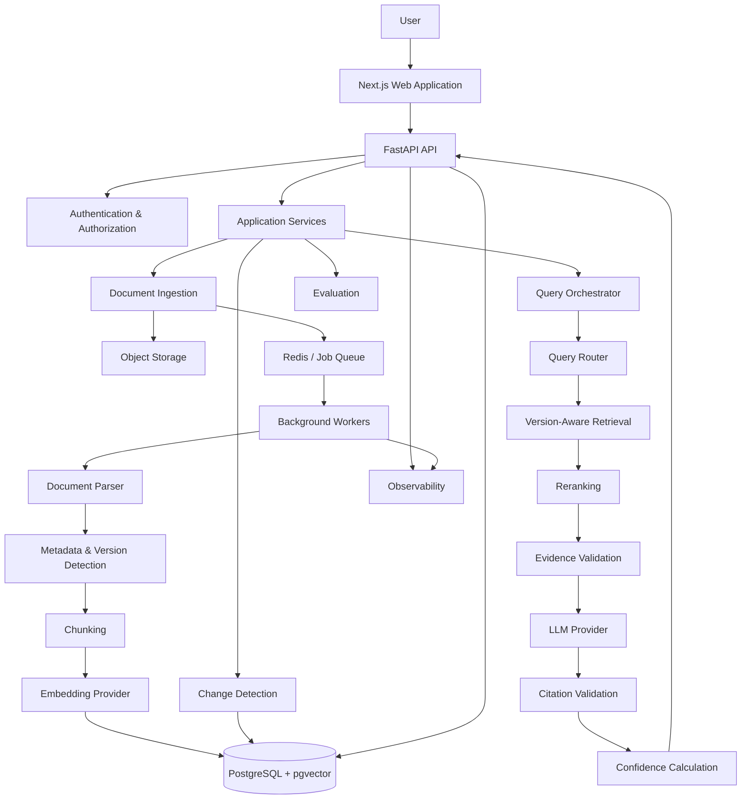
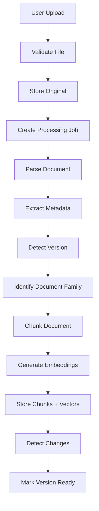
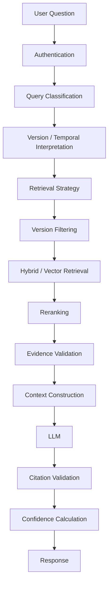
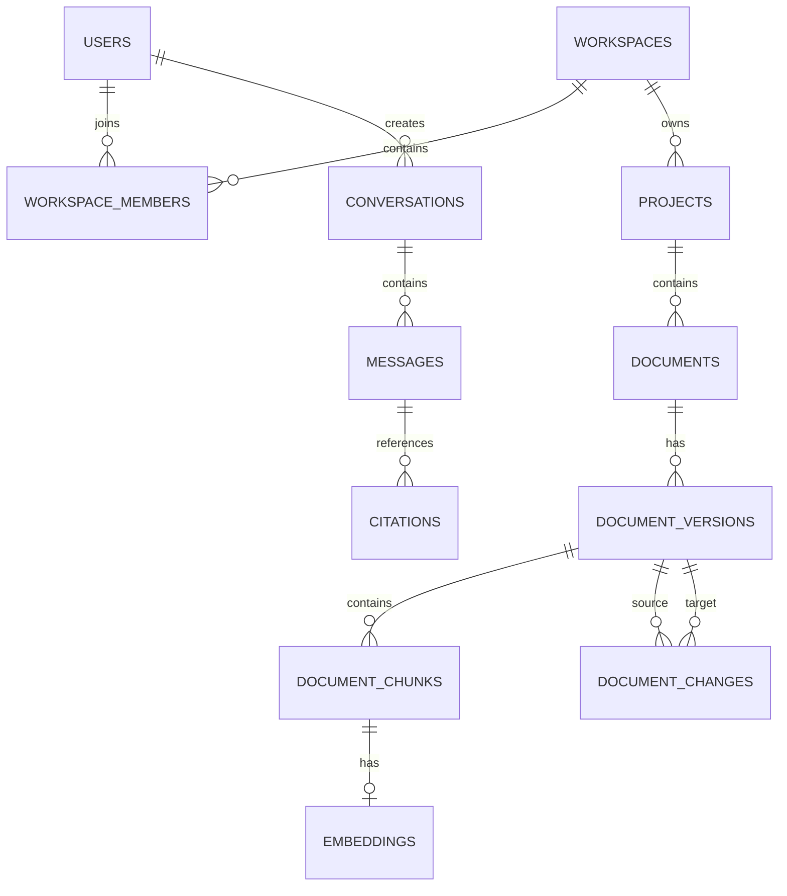
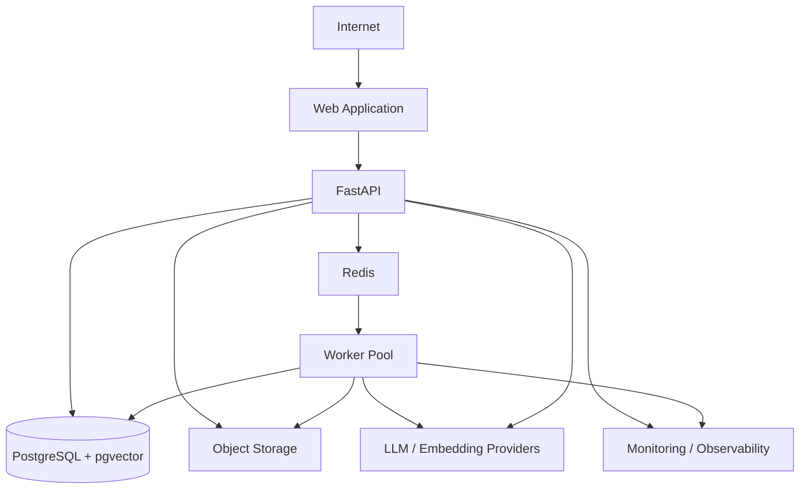

# VersionRAG — Architecture

## 1. Architecture Overview

VersionRAG is a production-oriented, version-aware Retrieval-Augmented Generation platform for evolving documents.

The architecture prioritizes:

1. Version correctness
2. Retrieval accuracy
3. Evidence traceability
4. Security
5. Data integrity
6. Reliability
7. Maintainability
8. Performance
9. Scalability
10. Cost efficiency

### High-Level Architecture



The architecture is intentionally designed as a modular application rather than a collection of unnecessary microservices.

---

## 2. System Architecture

### Frontend

Responsible for:

- authentication UI
- workspace/project management
- document upload
- version management
- search
- version comparison
- change timeline
- AI query interface
- evidence/citation display
- processing status
- evaluation dashboards
- settings

The frontend must not enforce security decisions. Authorization is enforced server-side.

### FastAPI Backend

Responsible for:

- API endpoints
- authentication integration
- authorization
- request validation
- application orchestration
- transaction boundaries
- initiating background jobs
- returning domain responses

Complex business logic belongs in services rather than route handlers.

### Application Services

Responsible for domain operations such as:

- document management
- version management
- retrieval orchestration
- change detection
- query routing
- conversations
- evaluations

### Document Processing

Responsible for:

- parsing
- normalization
- metadata extraction
- version detection
- document-family identification
- chunking
- indexing

### Background Workers

Long-running work is asynchronous.

Workers handle:

- document parsing
- metadata extraction
- embeddings
- change detection
- large indexing operations
- evaluation jobs

### PostgreSQL + pgvector

PostgreSQL is the primary system of record.

It stores relational data and vector embeddings where appropriate.

### Redis

Redis is used for:

- background job coordination
- short-lived caching where appropriate
- rate limiting where appropriate

Redis is not the source of truth for persistent application data.

### Object Storage

Original uploaded files and other large binary artifacts belong in object storage rather than PostgreSQL.

### AI Providers

External AI providers are accessed through internal provider abstractions so the application is not tightly coupled to one vendor.

---

## 3. End-to-End Data Flow

### Document Ingestion



Processing is asynchronous for operations that may take significant time.

### Query Flow



The retrieval layer controls the evidence available to the LLM.

---

## 4. VersionRAG Core Architecture

The core hierarchy is:

```text
Workspace
└── Project
    └── Document Family
        └── Document
            └── Version
                └── Chunks
                    └── Embeddings

Version A ──change──> Version B
Version B ──change──> Version C
```

Version is a first-class domain concept.

Every chunk retains its relationship to its exact version.

The system must never silently flatten all versions into one undifferentiated knowledge base.

### Core Version Invariant

Every retrieval-relevant chunk must remain traceable to:

```text
workspace_id
project_id
document_id
version_id
chunk_id
```

---

## 5. Version Model

A document version should support:

- version identifier
- normalized version value where possible
- release date where available
- source
- document family
- previous version
- next version
- ordering information
- processing state
- metadata

The system must not assume that every source uses semantic versioning.

Supported concepts should include:

- semantic versions such as `15.14.0`
- numeric versions
- date-based versions
- named versions
- arbitrary version identifiers
- unknown versions

### Version Ordering

Use the strongest available ordering signal:

1. explicit source ordering
2. semantic-version comparison
3. release date
4. normalized numeric ordering
5. manual ordering where necessary

Unknown ordering must remain explicit rather than being guessed.

---

## 6. Document Family / Clustering

The system needs to determine whether multiple documents represent versions of the same underlying document family.

Example:

```text
Node.js Assert Documentation v14
Node.js Assert Documentation v15
Node.js Assert Documentation v16
```

The pipeline should combine:

- extracted title
- normalized title
- document type
- source metadata
- URL/source identity
- version information
- deterministic matching
- semantic similarity when necessary

The LLM should not be the sole authority for clustering.

Ambiguous clustering should be reviewable.

Duplicate versions must be detected rather than silently overwritten.

---

## 7. Document Ingestion Architecture

The ingestion subsystem should support common document formats such as:

- PDF
- HTML
- Markdown
- TXT
- DOCX where appropriate

Pipeline:

```text
Upload
→ Validation
→ Object Storage
→ Parsing
→ Normalization
→ Metadata Extraction
→ Version Detection
→ Family Detection
→ Chunking
→ Embeddings
→ Indexing
→ Change Detection
```

Uploaded files are untrusted input.

The system must validate:

- file type
- MIME type
- extension
- file size
- filename
- content where appropriate

Uploaded files must never be executed.

---

## 8. Chunking Architecture

Chunking should preserve semantic boundaries where possible.

Each chunk should retain:

- chunk ID
- version ID
- document ID
- section/heading
- page number when applicable
- source location
- text
- token/character metadata where useful
- embedding

A reasonable initial strategy is approximately 512 tokens with approximately 50 tokens of overlap, but this should remain configurable and evaluation-driven.

Chunking must not destroy the source hierarchy.

---

## 9. Embedding Architecture

Use an internal embedding-provider abstraction.

Responsibilities include:

- embedding generation
- batching
- retries
- provider errors
- vector dimension validation
- model configuration
- re-embedding strategy

Embedding model identity should be stored with embeddings.

Changing embedding models must be treated as an explicit migration/re-indexing concern.

---

## 10. Retrieval Architecture

VersionRAG should support production-grade retrieval using:

- metadata filtering
- vector similarity
- lexical/BM25-style retrieval where useful
- hybrid retrieval
- reranking
- deduplication
- evidence diversity

### Version Rule

If a query explicitly specifies a version, retrieval must respect that constraint.

Example:

> Was feature X stable in version 15.14.0?

The system must not freely mix v14, v15, and v16 evidence.

Cross-version retrieval is allowed when the query explicitly requires comparison or temporal reasoning.

---

## 11. Query Router

At minimum, support:

- `CONTENT_QUERY`
- `VERSION_QUERY`
- `CHANGE_QUERY`
- `CROSS_VERSION_QUERY`
- `TIMELINE_QUERY`
- `AMBIGUOUS_QUERY`

Examples:

```text
"Was feature X available in v15?"
→ CONTENT_QUERY

"What versions exist?"
→ VERSION_QUERY

"What changed between v14 and v15?"
→ CHANGE_QUERY

"When was feature X introduced?"
→ CROSS_VERSION_QUERY / TIMELINE_QUERY
```

Use deterministic rules where possible and AI classification only where semantic interpretation is necessary.

---

## 12. Change Detection Architecture

### Explicit Changes

Extract changes from:

- changelogs
- release notes
- migration guides
- official change documentation

### Implicit Changes

Compare two versions directly.

A deterministic diff mechanism such as DeepDiff/text diff can identify structural or textual differences.

An LLM may convert raw differences into a human-readable explanation.

The LLM must not invent changes.

Every change should preserve:

```text
old_version_id
new_version_id
old_content
new_content
location
diff
change_type
description
evidence
```

A change description is not considered trustworthy unless its underlying evidence exists.

---

## 13. Answer Generation

The answer pipeline is:

```text
Question
→ Query Understanding
→ Retrieval
→ Version Validation
→ Evidence Selection
→ Context Construction
→ LLM
→ Citation Validation
→ Confidence
→ Response
```

The LLM is not the database and is not the source of truth.

If evidence is insufficient, the system should explicitly communicate uncertainty.

A fluent answer without adequate evidence is considered a failure.

---

## 14. Citation / Evidence Architecture

Evidence is a first-class system concept.

A citation should be able to identify:

- document
- version
- section
- page/location
- chunk
- source

Citations must be generated from actual retrieved evidence.

Never fabricate:

- page numbers
- URLs
- document versions
- source references

Where possible, the answer should link each important factual claim to the evidence that supports it.

---

## 15. Confidence Architecture

Do not use arbitrary LLM-generated confidence percentages.

Confidence should be derived from measurable signals such as:

- retrieval quality
- reranker score
- evidence agreement
- version consistency
- source quality
- answer/evidence alignment
- evidence quantity

Confidence should communicate uncertainty rather than create false precision.

If meaningful confidence cannot be calculated, use an uncertainty state instead.

---

## 16. Database Architecture

PostgreSQL is the primary system of record.

pgvector is used for vector similarity where appropriate.

### Core Entities

```text
users
workspaces
workspace_members
projects
documents
document_versions
document_chunks
embeddings
document_changes
conversations
messages
citations
processing_jobs
evaluation_runs
```

### Relationships



Use:

- foreign keys
- constraints
- indexes
- transactions
- migrations

Schema changes must use migrations.

---

## 17. Why PostgreSQL + pgvector

A single primary database reduces operational complexity.

PostgreSQL already provides:

- relational integrity
- transactions
- mature indexing
- filtering
- JSON support
- extensions
- pgvector integration

A dedicated graph database is not automatically required because the product contains relationships between versions.

A dedicated graph database should only be introduced if graph traversal requirements demonstrably exceed what the relational model can efficiently support.

Likewise, a separate vector database should only be introduced when scale or workload requirements justify its operational cost.

---

## 18. Background Job Architecture

Long-running work must not block ordinary API requests.

Use Redis-backed background workers or an equivalent justified mechanism.

Job states:

```text
PENDING
PROCESSING
COMPLETED
FAILED
RETRYING
CANCELLED
```

Jobs must support:

- bounded retries
- exponential backoff
- idempotency
- failure recording
- observability
- recovery

A worker crash must not corrupt document state or create duplicate derived data.

---

## 19. API Architecture

Major API boundaries:

```text
/auth
/workspaces
/projects
/documents
/versions
/search
/query
/changes
/conversations
/evaluations
/jobs
```

Every protected endpoint must enforce authentication and authorization.

Use:

- typed request schemas
- typed response schemas
- validation
- pagination
- consistent errors
- appropriate HTTP status codes

Do not expose database models directly when an API contract should be used.

---

## 20. Frontend Architecture

The frontend is a real product interface, not a portfolio site.

Major areas:

```text
Authentication
Dashboard
Workspace
Projects
Documents
Versions
Document Explorer
Version Comparison
Change Timeline
AI Query Interface
Evidence/Citations
Processing Status
Evaluations
Settings
```

The frontend must support:

- loading states
- empty states
- error states
- success states
- long-running processing states
- accessibility
- responsive layouts

Security decisions remain server-side.

---

## 21. Security Architecture

Security requirements include:

- authentication
- authorization
- RBAC
- workspace isolation
- secure file handling
- input validation
- rate limiting
- secret management
- audit logging
- prompt-injection protection

Uploaded documents must be treated as untrusted data.

Document instructions must never override application/system instructions.

---

## 22. Multi-Tenancy

The authorization hierarchy is:

```text
User
→ Workspace Membership
→ Project
→ Resource
```

A user must never access resources solely because they know a resource ID.

Consider PostgreSQL Row-Level Security when appropriate to provide defense-in-depth tenant isolation.

---

## 23. Observability

Use structured logging, metrics, and tracing where appropriate.

Track:

- request IDs
- job IDs
- latency
- processing failures
- retrieval latency
- model/provider latency
- token usage
- embedding latency
- error rates

Never log:

- passwords
- API keys
- access tokens
- unnecessary confidential document content

---

## 24. Performance

Use:

- database indexes
- vector indexes
- pagination
- batching
- connection pooling
- asynchronous processing
- caching where justified
- streaming where useful

Avoid:

- N+1 queries
- unbounded queries
- unnecessary network calls
- loading entire datasets
- synchronous expensive processing

Performance decisions should be measured rather than guessed.

---

## 25. Scalability

The initial system should remain a modular application.

It should be possible to scale:

```text
API instances
Worker instances
Database capacity
Vector indexes
Object storage
Redis
```

Do not introduce Kubernetes, service meshes, event buses, or microservices unless actual scale requirements justify them.

Complexity must be earned.

---

## 26. Failure & Recovery

Handle:

- upload failures
- parsing failures
- embedding failures
- LLM timeouts
- provider outages
- database failures
- Redis failures
- worker crashes
- duplicate uploads
- partial processing
- corrupted documents

Never report success until the underlying operation has actually completed.

---

## 27. Cost Architecture

Control AI cost using:

- batching
- caching
- deduplication
- incremental indexing
- appropriate model selection
- avoiding unnecessary LLM calls
- reusing embeddings
- processing only changed content

Do not call an expensive model when deterministic logic or a smaller model is sufficient.

---

## 28. Provider Abstraction

Define interfaces conceptually equivalent to:

```text
LLMProvider
EmbeddingProvider
RerankerProvider
```

The core application should not depend directly on one provider's SDK throughout the codebase.

Changing providers should not require rewriting the entire RAG architecture.

---

## 29. Testing Architecture

Use:

- unit tests
- integration tests
- API tests
- database tests
- retrieval tests
- security tests
- end-to-end tests
- evaluation tests

VersionRAG-specific tests must cover:

- version confusion
- wrong-version retrieval
- cross-version retrieval
- missing versions
- duplicate versions
- version comparison
- silent changes
- explicit changes
- citation correctness
- workspace isolation

---

## 30. Evaluation Architecture

Evaluation must distinguish:

- retrieval quality
- version correctness
- answer correctness
- citation correctness
- change detection accuracy
- latency
- cost

Never fabricate metrics.

Published paper metrics and VersionRAG's own experimental results must always be clearly separated.

Evaluation datasets should be versioned and reproducible.

---

## 31. Folder and File Structure

Use a clear modular repository.

A suitable starting structure is:

```text
versionrag/
├── apps/
│   └── web/
│       ├── app/
│       ├── components/
│       ├── features/
│       ├── lib/
│       └── tests/
│
├── services/
│   └── api/
│       ├── app/
│       │   ├── api/
│       │   ├── core/
│       │   ├── models/
│       │   ├── schemas/
│       │   ├── services/
│       │   ├── repositories/
│       │   ├── rag/
│       │   ├── ingestion/
│       │   ├── changes/
│       │   └── workers/
│       └── tests/
│
├── packages/
│   └── shared/
│
├── infrastructure/
│   ├── docker/
│   ├── migrations/
│   └── deployment/
│
├── evaluation/
│   ├── datasets/
│   ├── benchmarks/
│   └── reports/
│
├── docs/
│
├── tests/
│
├── .env.example
├── docker-compose.yml
├── README.md
├── architecture.md
└── rules.md
```

This structure is illustrative and should be adapted only when actual implementation requirements justify the change.

---

## 32. Deployment Architecture



Maintain separate:

- development
- staging
- production

environments.

Secrets must be environment-specific and securely managed.

---

## 33. CI/CD

A pull request should validate:

```text
Formatting
Linting
Type Checking
Unit Tests
Integration Tests
Security Checks
Build
Migration Validation
```

Production deployment should only occur after required checks pass.

---

## 34. Architectural Decision Records

### ADR-001 — PostgreSQL + pgvector

**Problem:** Need relational integrity and vector retrieval.

**Decision:** Use PostgreSQL with pgvector initially.

**Alternatives:** Qdrant, Milvus, separate vector DB.

**Reason:** Reduces operational complexity while supporting both relational and vector workloads.

### ADR-002 — Modular Application

**Problem:** Need maintainability without premature distributed-system complexity.

**Decision:** Begin with a modular application and background workers.

**Reason:** Clear boundaries without unnecessary microservices.

### ADR-003 — Redis + Workers

**Problem:** Document processing and AI tasks can be long-running.

**Decision:** Use asynchronous workers.

**Reason:** Prevents long-running work from blocking API requests.

### ADR-004 — Version-Aware Retrieval

**Problem:** Normal RAG can mix incompatible versions.

**Decision:** Version metadata is first-class and retrieval is version-aware.

**Reason:** Version correctness is the central product requirement.

### ADR-005 — Provider Abstraction

**Problem:** Avoid vendor lock-in.

**Decision:** Abstract LLM, embedding, and reranking providers.

**Reason:** Enables provider/model changes without rewriting core application logic.

### ADR-006 — Explicit + Implicit Change Detection

**Problem:** Some changes appear in changelogs; others are undocumented.

**Decision:** Combine explicit change extraction with deterministic comparison and LLM-assisted explanation.

**Reason:** Provides broader change coverage while retaining evidence.

### ADR-007 — Evidence/Citation Architecture

**Problem:** Generated answers need traceability.

**Decision:** Evidence and citations are first-class objects.

**Reason:** Users must be able to verify important answers.

---

## 35. Architectural Trade-offs

### Simplicity vs Scale

The initial architecture favors simplicity and modularity over premature distributed infrastructure.

### Cost vs Accuracy

Expensive AI operations should be reserved for tasks that require semantic reasoning.

### Latency vs Retrieval Depth

More retrieval and reranking can improve recall but increase latency and cost. The system should measure this trade-off.

### Deterministic Logic vs AI

Deterministic logic is preferred for version parsing, authorization, filtering, validation, and state management.

AI is reserved for semantic interpretation.

### Single Database vs Specialized Databases

A single primary database reduces operational complexity. Specialized systems should be introduced only when measurable requirements justify them.

---

## 36. Security Threat Model

| Threat | Impact | Mitigation |
|---|---|---|
| Unauthorized document access | Critical | Server-side authorization + tenant isolation |
| Cross-workspace retrieval | Critical | Workspace/project filtering + defense-in-depth |
| Prompt injection | High | Treat documents as data, not instructions |
| Malicious file | High | File validation, isolation, safe parsing |
| API abuse | Medium/High | Rate limiting + authentication |
| Secret exposure | Critical | Secure secret management |
| Data exfiltration | Critical | Access controls + evidence boundaries |
| Version confusion | High | First-class version metadata + retrieval constraints |
| Citation fabrication | High | Citation validation against retrieved evidence |
| Provider failure | Medium/High | Retries, fallbacks, explicit failure states |

---

## 37. Non-Negotiable Architecture Rules

1. Version correctness comes before answer fluency.
2. The LLM is not the source of truth.
3. Retrieved evidence must be traceable.
4. User data must be tenant-isolated.
5. Authorization must be server-side.
6. Long-running processing must be asynchronous.
7. Deterministic logic should be used whenever possible.
8. Never fabricate data, citations, confidence, or metrics.
9. Never silently change major architecture.
10. Never add unnecessary infrastructure.
11. Production features must be observable and testable.
12. Every important document operation must preserve version metadata.
13. A user must never receive evidence from an unauthorized workspace.
14. A version-specific query must not silently become an unrestricted all-version query.
15. The system must prefer an explicit uncertainty response over an unsupported answer.
